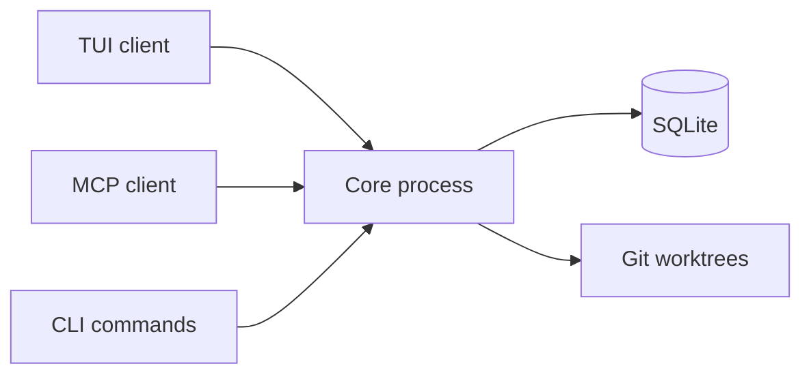

# Architecture overview

This page explains how Kagan works at a high level so you can reason about behavior, reliability, and troubleshooting.

## Core components

| Component                   | Purpose                                               |
| --------------------------- | ----------------------------------------------------- |
| TUI (`kagan` / `kagan tui`) | Main keyboard-first interface                         |
| MCP server (`kagan mcp`)    | Lets external AI tools read and mutate Kagan state    |
| Core process (`kagan core`) | Coordinates runtime operations and state changes      |
| SQLite database             | Stores projects, tasks, reviews, and runtime metadata |
| Git worktrees               | Isolated working directories for task execution       |

## System flow

## What is shared across interfaces

All interfaces operate on the same project/task state.

- A task created from MCP appears in TUI.
- A review decision made in TUI is visible to MCP tools.
- Core lifecycle and runtime metadata are shared by all clients.

## Data persistence model

Kagan stores state outside your repository.

- Config: `config.toml` in the Kagan config directory
- Database: `kagan.db` in the Kagan data directory
- Runtime files: core endpoint/token/lease files in the core runtime directory
- Worktrees: under the configured worktree base directory

Kagan does not create a `.kagan/` folder inside your repo.

## Why this matters

- Use `kagan core status` when TUI or MCP connectivity looks wrong.
- Use MCP safely with capability profiles (`viewer`, `pair_worker`, `operator`, `maintainer`).
- Use [Troubleshooting](../troubleshooting.md) when errors mention runtime metadata, stale tokens, or lock ownership.
