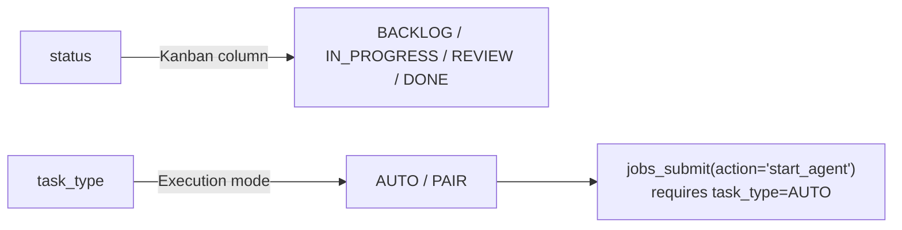

# MCP Setup

Use MCP when an external AI tool should operate on Kagan tasks.

## TL;DR

```bash
kagan mcp
```

Default setup exposes the full toolset and connects to the local Kagan core.

## Start modes

```bash
kagan mcp                                  # Full tools
kagan mcp --readonly                       # Read-only tools
kagan mcp --session-id task:TASK-001       # Session-scoped lane
kagan mcp --capability pair_worker         # Capability-scoped tools
kagan mcp --identity kagan_admin           # Admin lane (explicit opt-in)
```

## Recommended launch profiles

| Use case                 | Command                                                         |
| ------------------------ | --------------------------------------------------------------- |
| Safe read-only assistant | `kagan mcp --readonly --capability viewer`                      |
| Task worker              | `kagan mcp --capability pair_worker --session-id task:TASK-123` |
| Admin/operator           | `kagan mcp --identity kagan_admin --capability maintainer`      |

## Client configuration paths

For manual setup outside TUI-managed session injection:

| Client         | Config file                             |
| -------------- | --------------------------------------- |
| Claude Code    | `~/.claude.json` or project `.mcp.json` |
| OpenCode       | `~/.config/opencode/opencode.json`      |
| Codex          | `~/.codex/config.toml`                  |
| Gemini CLI     | `~/.gemini/settings.json`               |
| Kimi CLI       | `~/.kimi/mcp.json`                      |
| GitHub Copilot | `~/.copilot/mcp-config.json`            |
| VS Code        | `.vscode/mcp.json`                      |
| Cursor         | `.cursor/mcp.json`                      |

Minimal server entry:

```text
command: kagan
args: ["mcp"]
```

## Verify

1. Start MCP: `kagan mcp`
1. In your AI client, call `tasks_list`
1. Confirm tasks are returned from the current project

## Core restart behavior

- Auto-retries once on transient IPC disconnects.
- Token rotation after core restart returns `AUTH_STALE_TOKEN` -- MCP process should reconnect.

## Common automation gotcha



- `jobs_submit` may return `START_PENDING` before scheduler admission (check via `jobs_wait`/`jobs_get`).
- Sending `status="AUTO"|"PAIR"` by mistake: `tasks_create`/`tasks_update` auto-normalize to `task_type`; `tasks_move` returns remediation (`next_tool="tasks_update"`).

## TUI sync

MCP-initiated changes (agent starts, stops, reviews, merges) reflect in the TUI on the next sync tick. Runtime fields (`is_blocked`, `is_pending`, etc.) documented in [MCP Tools Reference](../reference/mcp-tools.md).

## Next

- Full tool catalog: [MCP Tools Reference](../reference/mcp-tools.md)
- Server options: [Configuration](../reference/configuration.md)
- Common issues: [Troubleshooting](../troubleshooting.md)
