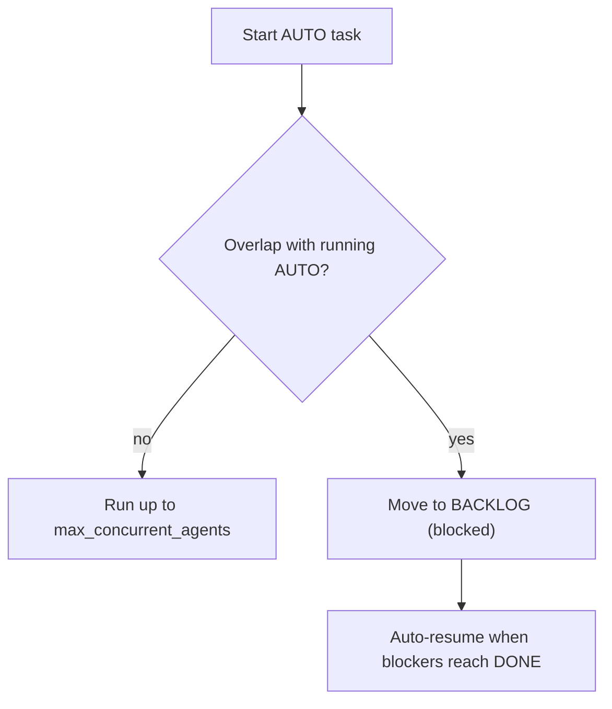

# AUTO vs PAIR

## TL;DR

| If this is true...                         | Use    |
| ------------------------------------------ | ------ |
| Task is clear and bounded                  | `AUTO` |
| Task is ambiguous or exploratory           | `PAIR` |
| You want parallel background execution     | `AUTO` |
| You want tight manual control while coding | `PAIR` |

## Quick decision

| Question        | Choose `AUTO` when...   | Choose `PAIR` when...            |
| --------------- | ----------------------- | -------------------------------- |
| Problem clarity | Requirements are clear  | Requirements are evolving        |
| Risk            | Low-to-medium           | Medium-to-high                   |
| Your time       | You want async progress | You want real-time collaboration |
| Learning need   | Low                     | High                             |

## AUTO fast path

1. Create task (`n`)
1. Keep type `AUTO`
1. Start run (`Enter` or `a`)
1. Review in `REVIEW`
1. Approve/reject, then merge

Best for: implementation tasks with crisp acceptance criteria.

With `serialize_merges = true`, merges are queued. Kagan may pre-rebase higher-risk merges and auto-rebases once if merge fails due to base branch advancement.

### Conflict-aware admission



- `BACKLOG` header shows blocked count; blocked tasks pinned first.
- `Enter` on a blocked task shows blocker/reason details in Task Output.
- MCP `jobs_submit` + `jobs_wait` expose `running`/`queued`/`blocked` states.

## PAIR fast path

1. Create task (`n`)
1. Set type `PAIR`
1. Open session (`Enter`)
1. Collaborate in terminal backend
1. Move through `IN_PROGRESS` -> `REVIEW` manually

Best for: debugging, discovery, architecture changes, uncertain scope.

## Key differences

| Aspect                 | `AUTO`                   | `PAIR`                      |
| ---------------------- | ------------------------ | --------------------------- |
| Execution              | Agent runs independently | You and agent work together |
| Session style          | Background               | Interactive                 |
| Task state transitions | Mostly automated         | Mostly manual               |
| Typical speed          | Faster for clear tasks   | Faster for uncertain tasks  |

## Configuration that matters

```toml
[general]
default_worker_agent = "claude"
default_pair_terminal_backend = "tmux"
max_concurrent_agents = 3
auto_review = true
```

Full setting details: [Configuration](../reference/configuration.md).
