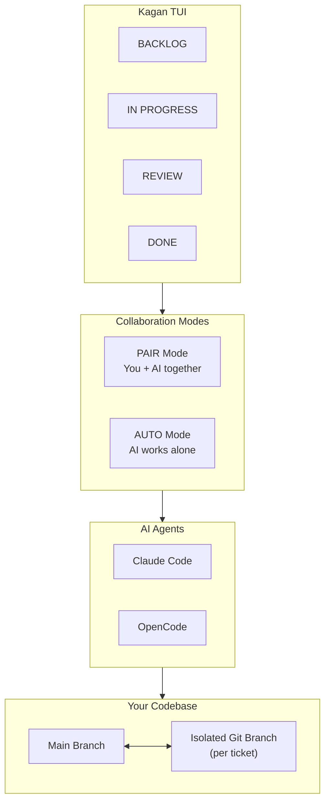

# Kagan

Keyboard-first Kanban TUI that turns your terminal into an AI-powered development workspace.

## Quick Start

```bash
# Install
uv tool install kagan

# Launch in any git repo
cd your-project && kagan

# Create your first ticket: press 'n', enter details, press 'Enter' to start
```

!!! info "Requirements"
    Python 3.12+, terminal (min 80x20), git repo (for worktrees), tmux (for PAIR mode)

## Essential Shortcuts

| Key         | Action                             |
| ----------- | ---------------------------------- |
| `n`         | New ticket                         |
| `Shift+N`   | New AUTO ticket (quick create)     |
| `a`         | Start agent                        |
| `Enter`     | Open session (PAIR) / watch (AUTO) |
| `g` `h`/`l` | Move ticket left/right             |
| `Space`     | Peek (toggle status overlay)       |
| `?` / `F1`  | Show help                          |

See the [full keyboard reference](keybindings.md) for all shortcuts.

## Two Collaboration Modes

Kagan offers two ways to work with AI on your tickets:

### AUTO Mode

Autonomous agents that work independently on tickets.

- Press ++a++ to start an agent, ++w++ to watch progress
- Agent works in background, moves to REVIEW when done
- Ideal for well-defined tasks and parallel execution

### PAIR Mode

Interactive tmux session where you work alongside your AI agent in real-time.

- Press ++enter++ on any ticket to open a shared terminal
- Agent has access to ticket context via MCP tools
- Perfect for complex problems requiring back-and-forth

!!! tip "Choosing the right mode"
    Use **AUTO** for well-defined tasks with clear acceptance criteria. Use **PAIR** when you need to explore, debug, or learn alongside the AI.

Read the [Ticket Modes Guide](ticket-modes.md) for detailed state machines and workflow tips.

## Kanban Board

Classic workflow: **BACKLOG** → **IN_PROGRESS** → **REVIEW** → **DONE**

Move tickets between columns with ++g++ ++h++ / ++g++ ++l++. Track multiple workstreams with visual priority badges and agent assignments.

## AI Planner

Press ++p++ to describe your goal in natural language. The planner breaks it down into actionable tickets with acceptance criteria. Review, refine, and approve—then watch your board populate automatically.

## Review Flow

Built-in code review with AI assistance:

1. Ticket moves to REVIEW when agent completes work
2. View diffs (++shift+d++), inspect commits, run tests
3. Approve (++a++) to merge or reject (++r++) with feedback
4. Auto-merge on approval (configurable)

## MCP Integration

Agents access ticket context through MCP (Model Context Protocol):

- `get_context(ticket_id)` — Full ticket details and acceptance criteria
- `update_scratchpad(ticket_id, content)` — Append progress notes
- `request_review(ticket_id, summary)` — Submit work for review

Run the MCP server: `kagan mcp`

## Architecture Overview



Each ticket gets its own isolated git branch, keeping your main branch safe until changes are reviewed and approved.

## Ticket Lifecycle


| Column          | AUTO Mode                            | PAIR Mode               |
| --------------- | ------------------------------------ | ----------------------- |
| **BACKLOG**     | Waiting to start                     | Waiting to start        |
| **IN_PROGRESS** | Agent works autonomously             | You collaborate with AI |
| **REVIEW**      | Auto-moves here when agent completes | You move here manually  |
| **DONE**        | Merged (auto or manual)              | Merged manually         |

!!! note "Key difference"
    AUTO tickets have automatic state transitions driven by the agent. PAIR tickets are fully manual—you control when they move between columns.

## Supported AI CLIs

- **Claude Code** (Anthropic)
- **OpenCode** (open source)

Coming soon: Gemini, Codex, and more.

## Configuration

Configuration lives in `.kagan/config.toml`. Key settings:

| Setting                 | Purpose                              |
| ----------------------- | ------------------------------------ |
| `auto_start`            | Auto-run agents on ticket creation   |
| `auto_approve`          | Skip permission prompts              |
| `auto_merge`            | Merge approved tickets automatically |
| `default_worker_agent`  | Default agent (e.g., "claude")       |
| `max_concurrent_agents` | Parallel agent limit                 |

See [Configuration](config.md) for the full reference.

## Contributing

We welcome contributions! For development setup, testing, and code style guidelines:

- [CONTRIBUTING.md on GitHub](https://github.com/aorumbayev/kagan/blob/main/CONTRIBUTING.md)
- [GitHub Issues](https://github.com/aorumbayev/kagan/issues) — Report bugs
- [GitHub Pull Requests](https://github.com/aorumbayev/kagan/pulls) — Submit code
- [GitHub Discussions](https://github.com/aorumbayev/kagan/discussions) — Ask questions
