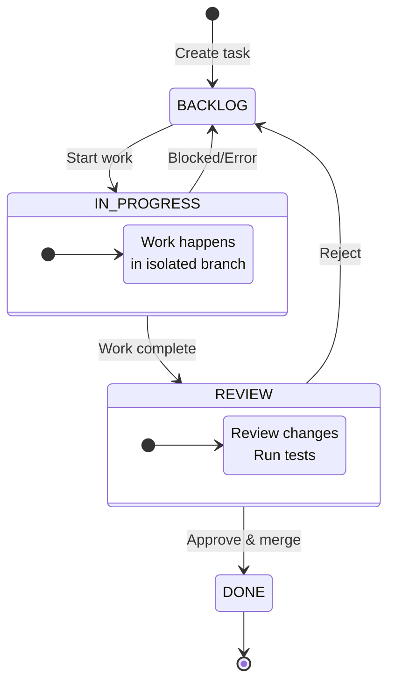

# Kagan

Keyboard-first Kanban TUI that turns your terminal into an AI-powered development workspace.

## Quick Start

```bash
# Install (requires Python 3.12+)
uv tool install kagan

# Launch inside a git repo
cd your-project
kagan
```

!!! tip "Help is always one key away"
Press ++question++ or ++f1++ on any screen.

## Guided Tour (Follow Along)

### Step 1: Pick Or Create A Project

When Kagan starts, you land on the Welcome screen.

Press ++enter++ to open the highlighted project. Press ++n++ to create a new project, ++o++ to open a folder, ++s++ for settings, or ++1++ to ++9++ to open by number. Press ++esc++ to quit.

!!! tip "Try it now"
Create a project with ++n++ or open an existing one with ++enter++.

### Step 2: Choose Your Active Repository

If your project has multiple repos, use the repo picker any time with ++ctrl+r++.

In the repo picker, use ++up++/++down++ or ++j++/++k++ to navigate, ++enter++ to select, ++n++ to add a repo, and ++esc++ to cancel.

### Step 3: Learn Board Navigation

The Kanban board is keyboard-first.

Use ++h++/++j++/++k++/++l++ or arrow keys to move focus. Use ++tab++ / ++shift+tab++ to jump columns. Press ++esc++ to clear focus, close search, or close the peek overlay.

Press ++slash++ to search tasks. Press ++space++ to toggle the peek overlay for the selected task.

Double-click any card to open Task Details.

### Step 4: Create And Edit A Task

Press ++n++ to create a task. Fill in title, description, acceptance criteria, priority, type, and agent. Press ++f2++ (or ++alt+s++) to save.

Open Task Details with ++v++. Toggle edit mode with ++e++. Press ++f++ to view the full description (read-only) or ++f5++ to edit the description in a full-screen editor.

Use ++y++ to duplicate a task, ++c++ to copy its ID, and ++x++ to delete.

### Step 5: Use The Actions Palette

Press ++period++ or ++ctrl+p++ to open the Actions palette. Type to filter commands, press ++enter++ to run one.

This is the fastest way to discover context-specific actions.

### Step 6: Run AUTO Tasks

AUTO tasks run in the background.

Select an AUTO task and press ++enter++ to start (with confirmation) and open output. Press ++enter++ on an IN_PROGRESS AUTO task to reopen output, and ++s++ to stop a running agent.

### Step 7: Run PAIR Tasks

PAIR tasks open an interactive session using tmux (default on macOS/Linux) or VS Code/Cursor.

Select a PAIR task and press ++enter++ to open the session. If the PAIR instructions popup appears, press ++enter++ to continue, ++esc++ to cancel, or ++s++ to skip this prompt next time.

If a permission prompt appears, use ++enter++ to allow once, ++a++ to allow always, or ++esc++/++n++ to deny.

### Step 8: Plan Mode (AI Planner)

Press ++p++ to enter Plan Mode. Describe what you want to build in natural language and press ++enter++ to send. Use ++shift+enter++ or ++ctrl+j++ for a newline.

Use `/help` for planner commands and `/clear` to reset the conversation. Press ++f2++ to enhance your prompt, ++ctrl+c++ to stop a run, and ++esc++ to return to the board.

When a plan is generated, the approval panel appears. Use ++up++/++down++ or ++j++/++k++ to select, ++enter++ to preview, ++a++ to approve, ++e++ to edit, and ++d++ or ++esc++ to dismiss.

### Step 9: Review And Merge

In REVIEW, press ++enter++ to open the review workspace. Use the Diff, AI Review, and Agent Output tabs; press ++enter++ to approve or ++r++ to reject.

If you reject, the rejection prompt lets you send back to IN_PROGRESS with ++enter++ or move to BACKLOG with ++esc++.

Press ++m++ on the board to merge approved work. If there are no changes, the review modal offers "Close as Exploratory."

### Step 10: Settings, Debug, And Selectors

Press ++comma++ for Settings and ++f12++ for the Debug Log. Use ++ctrl+o++ to return to the project selector and ++ctrl+r++ for the repo selector.

## Visual Indicators

Card borders and badges help you read the board quickly.

Green border means a PAIR session is active. A pulsing border means an agent is actively running. A human icon indicates PAIR, and a lightning icon indicates AUTO.

## Multi-Repo Features

Use ++b++ to set a task base branch and ++shift+b++ to set a global default branch. Base branches are stored per repo and used for diffs and merges.

Task Details show a Workspace Repos section for multi-repo workspaces. Use the Diff and Merge buttons there to open per-repo diffs or the merge dialog.

## Keyboard Reference

Press ++question++ in the app or see the full [Keyboard Shortcuts](keybindings.md) page.

## MCP Integration

Agents access task context through MCP (Model Context Protocol).

### Read-Only Tools (Available in All Modes)

- `propose_plan(tasks, todos)`: Submit a structured plan proposal for planner mode
- `get_parallel_tasks(exclude_task_id)`: Get all IN_PROGRESS tasks for coordination
- `get_task(task_id, include_logs=true)`: Get agent execution logs from any task

### Full Tools (PAIR Mode Only)

- `get_context(task_id)`: Full ticket details and acceptance criteria
- `update_scratchpad(task_id, content)`: Append progress notes
- `request_review(task_id, summary)`: Submit work for review

### How ACP vs PAIR Flows Work

```text
AUTO (ACP)
User -> Kagan UI -> ACP agent process
                   |  ACP tool calls (fs/terminal/permission)
                   |  MCP tools via `kagan mcp --readonly`
                   v
                Agent response stream -> Kagan UI (planner/cards/logs)

PAIR (Interactive CLI + MCP)
User -> Kagan UI -> terminal/IDE session (tmux/VS Code/Cursor)
                   -> Agent CLI uses MCP over stdio
                   -> `kagan mcp` (full tools)
                   -> Kagan DB -> Kagan UI
```

Run the MCP server: `kagan mcp`

Tool names are client-dependent. You may see the tools as
`mcp__kagan__get_context`, `kagan_get_context`, or similar depending on the
agent. The MCP server name defaults to `kagan` and can be changed via
`general.mcp_server_name` or `KAGAN_MCP_SERVER_NAME`.

## Developer Tools

Kagan includes stateless utilities for developers:

```bash
kagan tools enhance "fix the login bug"                    # Enhance a prompt
kagan tools enhance "add dark mode" -t opencode            # Target specific AI tool
kagan tools enhance --file prompt.txt                      # Read from file
kagan tools enhance -f requirements.md -t claude           # Target with file input
```

## Configuration

Configuration lives in the XDG config `config.toml`. Key settings:

| Setting                   | Purpose                                                              |
| ------------------------- | -------------------------------------------------------------------- |
| `auto_review`             | Run AI review on task completion                                     |
| `auto_approve`            | Skip permission prompts in the planner (workers always auto-approve) |
| `require_review_approval` | Require review approval before merge                                 |
| `serialize_merges`        | Serialize manual merges to reduce conflicts                          |
| `default_worker_agent`    | Default agent (e.g., "claude")                                       |
| `max_concurrent_agents`   | Parallel agent limit                                                 |
| `default_base_branch`     | Fallback base branch for new repos                                   |

Base branches are stored per repository. On first open, you will be prompted to select one, and
merges/rebases target that branch.

See [Configuration](config.md) for the full reference.

## Architecture Overview


Each task gets its own isolated git branch, keeping your main branch safe until changes are reviewed and approved.

## Task Lifecycle



| Column          | AUTO Mode                            | PAIR Mode               |
| --------------- | ------------------------------------ | ----------------------- |
| **BACKLOG**     | Waiting to start                     | Waiting to start        |
| **IN_PROGRESS** | Agent works autonomously             | You collaborate with AI |
| **REVIEW**      | Auto-moves here when agent completes | You move here manually  |
| **DONE**        | Merged manually                      | Merged manually         |

!!! note "Key difference"
AUTO tasks have automatic state transitions driven by the agent. PAIR tasks are fully manual; you control when they move between columns.

## Supported AI CLIs

- **Claude Code** (Anthropic)
- **OpenCode** (open source)

Coming soon: Gemini, Codex, and more.
