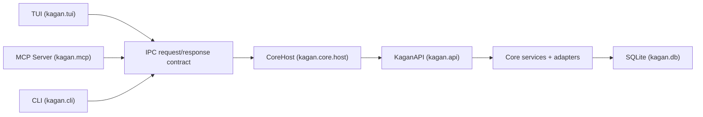
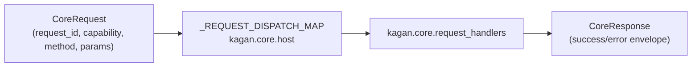

# Architecture

Contributor-facing source of truth for Kagan architecture. If a change modifies IPC, API boundary, MCP, locking, or runtime ownership contracts, update this page in the same change.

## Alpha invariants

1. One core daemon owns mutable domain state and DB writes.
1. SQLite is the only persisted source of truth.
1. TUI, MCP, and CLI are stateless frontends over core operations.
1. Authorization is enforced in core before operation dispatch.
1. No runtime fallback path may bypass core.
1. Runtime locks are explicit and deterministic.

## System shape

## Package boundaries

| Module | Path              | Responsibility                                                        |
| ------ | ----------------- | --------------------------------------------------------------------- |
| `core` | `src/kagan/core/` | Domain models, services, DB adapters, runtime host, API boundary, ACP |
| `tui`  | `src/kagan/tui/`  | Textual UI screens/widgets/modals; no direct service access           |
| `mcp`  | `src/kagan/mcp/`  | MCP server, capability-aware tool registration, IPC bridge            |
| `cli`  | `src/kagan/cli/`  | CLI entry points                                                      |

## Canonical contracts

### 1) IPC envelope and dispatch

Contracts defined in `kagan.core.ipc.contracts`. Legacy command/query fallback paths are removed.

### 2) Typed orchestration boundary (API)

- `KaganAPI` (`kagan.api`) covers task, review, jobs, sessions, projects, settings, and audit operations.
- TUI uses `ctx.api.*`; `ctx.api.ctx.<service>` is a temporary bridge.
- Boundary enforcement: `tests/tui/smoke/test_tui_api_boundary.py`.

### 3) MCP registration and bridge

- Tools talk to core through `CoreClientBridge` (`kagan.mcp.tools`).
- Tool registration: `kagan.mcp.registrars`.
- Fail-fast on core unavailable; no degraded bypass (`kagan.mcp.server`).

### 4) Security and profile enforcement

- Profiles defined in `kagan.core.security`.
- Core checks session profile/origin before dispatch.
- MCP applies profile ceilings and identity lanes before serving tools.

### 5) Locking and runtime ownership

- Core singleton: `core.instance.lock` + `core.lease.json` (`kagan.paths`, `kagan.core.instance_lease`).
- Discovery via runtime files: `endpoint.json`, `token`, lease metadata.
- TUI enforces one instance per repo via `InstanceLock` (`kagan.instance_lock`, `kagan.app`).

### 6) Plugin SDK scaffold

- Manifest, loader, registration in `kagan.plugins.sdk`.
- Core wires plugins via `AppContext.plugin_registry` during bootstrap.
- `CoreHost` evaluates policy hooks and dispatches plugin operations.
- Built-in no-op example: `kagan.plugins.examples.noop`.
- Full lifecycle: [Plugin SDK Lifecycle](plugin-sdk.md).

## Contributor guardrails

1. Do not introduce parallel dispatch authorities or client-side mutation fallbacks.
1. Keep DB writes and mutation orchestration in core services/adapters.
1. Preserve structured recovery fields: `success`, `code`, `message`, `hint`, `next_tool`, `next_arguments`.
1. When contracts change, update this page.

## Related references

- [Contributing](../contributing.md)
- [MCP Tools Reference](mcp-tools.md)
- [Configuration](configuration.md)
- [Plugin SDK Lifecycle](plugin-sdk.md)
- [Pinned alpha architecture contract (planning)](https://github.com/aorumbayev/kagan/blob/main/.github/context/alpha-strangler-migration/ARCHITECTURE-CONTRACT.md)
