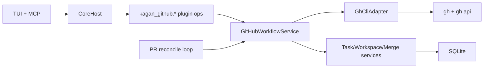

# GitHub Plugin Architecture (Lightweight, gh CLI + GitHub App)

## Goal

Provide the most natural GitHub integration for a Kanban-first Kagan experience with a minimal V1 scope:

- board tasks are backed by GitHub issues after repo connect
- tasks in `REVIEW` must be tied to a PR
- merged PR moves task to `DONE`
- implementation stays lightweight and `gh`-CLI driven

## Non-Collision Contract

Official GitHub MCP tools are reserved and must not be registered by Kagan:

- `github.connect_repo`
- `github.sync_issues`
- `github.create_pr_for_task`
- `github.link_pr_to_task`
- `github.reconcile_pr_status`
- `github.repair_task_issue_mapping`

Kagan plugin namespace:

- core capability: `kagan_github`
- core methods:
  - `connect_repo`
  - `sync_issues`
  - `create_pr_for_task`
  - `link_pr_to_task`
  - `reconcile_pr_status`
  - `repair_task_issue_mapping`

Kagan MCP tool names:

- `kagan_github_connect_repo`
- `kagan_github_sync_issues`
- `kagan_github_create_pr_for_task`
- `kagan_github_link_pr_to_task`
- `kagan_github_reconcile_pr_status`
- `kagan_github_repair_task_issue_mapping`

Rule:

- Kagan never exposes `github.*` tool names.
- If an external official GitHub MCP server is connected, both can coexist safely.

## V1 Reduced Feature Set

This is the smallest high-value set for seamless Kanban + GitHub flow.

1. Connect repo

- Validate git remote and `owner/repo`.
- Validate `gh` availability and auth.
- Validate GitHub App installation exists for repo.
- Persist repo binding in Kagan project metadata.

2. Sync issues to tasks (source of truth)

- Pull open issues via `gh api`.
- Upsert task records using `task.github_issue_number` mapping.
- Create missing tasks from issues.
- Update task title/body/status when issue changes.
- Close or mark done when issue is closed (policy-controlled).

3. Create PR for task

- Allowed only when task has issue mapping.
- Create PR via `gh pr create` with task/issue references.
- Move task to `REVIEW`.
- Persist PR URL/number/status in existing merge fields.

4. Link existing PR to task

- For already-open PRs or external PR creation.
- Enforce one active PR per task in V1.
- Move task to `REVIEW` if link succeeds.

5. Reconcile PR status

- Poll PR status via `gh pr view --json` or `gh api`.
- Update merge/task state:
  - merged -> `DONE`
  - closed/unmerged -> back to `IN_PROGRESS`
  - open -> stay in `REVIEW`

6. Repair issue-task mapping

- Backfill missing mappings from issue refs in task body/title.
- Resolve duplicates deterministically and report conflicts.

## Natural Mapping to Kagan Kanban

- `BACKLOG`: issue exists, no active workspace work.
- `IN_PROGRESS`: developer working branch/workspace for mapped issue.
- `REVIEW`: PR is required and linked.
- `DONE`: PR merged (or issue closed per configured policy).

Invariants:

- Task in `REVIEW` must have `pr_url`.
- Task with `pr_url` must map to a GitHub issue.
- Issue number is canonical external identifier.

## User Flows (Developer in Kagan TUI)

1. First-time connect

- Developer opens repo in Kagan.
- Runs `Connect GitHub` action.
- Kagan checks `gh`, auth, repo access, and GitHub App installation.
- Success marks repo as GitHub-connected.

2. Populate board from issues

- Developer runs `Sync Issues`.
- Board loads tasks from repo issues.
- Existing mapped tasks are updated, new ones created.

3. Start work

- Developer selects issue-backed task and moves it to `IN_PROGRESS`.
- Uses normal Kagan workspace/session flow.

4. Send task to review

- Developer selects `Create PR` on task.
- Kagan creates PR, stores `pr_url`, and moves task to `REVIEW`.
- If PR already exists, developer uses `Link PR` instead.

5. Review lifecycle

- Review column continuously reflects PR state from reconcile loop.
- Merge detected -> task moves to `DONE`.
- PR closed without merge -> task returns to `IN_PROGRESS`.

6. Recovery

- If mapping drift occurs, developer runs `Repair Mapping` then `Sync Issues`.

## User Flows (Admin via MCP, `kagan_admin` lane)

1. Organization/repo onboarding

- Call `kagan_github_connect_repo` for each managed repo.
- Validate GitHub App installation and permissions.

2. Scheduled sync

- Call `kagan_github_sync_issues` periodically to keep board consistent with issues.

3. PR-state reconciliation

- Call `kagan_github_reconcile_pr_status` periodically or on demand.
- This keeps `REVIEW` and `DONE` columns accurate.

4. Repair and backfill

- Call `kagan_github_repair_task_issue_mapping` after imports/migrations/manual edits.

5. Controlled PR operations

- For automation tasks, use:
  - `kagan_github_create_pr_for_task`
  - `kagan_github_link_pr_to_task`

## Auth Model (V1)

Two auth paths, one transport (`gh`):

1. Developer interactive mode

- Uses local `gh auth login` user session.
- Best for TUI-driven day-to-day flow.

2. Admin automation mode

- Uses GitHub App installation token injected as `GH_TOKEN`.
- Best for background MCP sync/reconcile jobs.

## GitHub App Setup (V1)

Assumption: GitHub App is available for V1.

1. Create/configure GitHub App

- App visibility: your org.
- Repository permissions:
  - Issues: Read and write
  - Pull requests: Read and write
  - Contents: Read
  - Metadata: Read-only
- Webhooks: optional for V1 (polling is enough).

2. Install app

- Install on target repos (selected repos preferred for least privilege).

3. Capture app credentials

- `APP_ID`
- `INSTALLATION_ID` (per org/repo installation)
- private key PEM

4. Configure Kagan runtime

- `KAGAN_GITHUB_APP_ID=<app_id>`
- `KAGAN_GITHUB_APP_INSTALLATION_ID=<installation_id>`
- `KAGAN_GITHUB_APP_PRIVATE_KEY_PATH=/abs/path/to/private-key.pem`
- `KAGAN_GITHUB_HOST=github.com` (or your GHE host)

5. Validate from repo path

- `gh auth status`
- `gh repo view owner/repo`
- `gh api repos/owner/repo/issues --paginate -F per_page=1`

6. Validate in Kagan

- Run `kagan_github_connect_repo`.
- Run `kagan_github_sync_issues` and confirm tasks appear.
- Move one task to `REVIEW` with PR and run reconcile.

## Internal Architecture

Components:

- `GitHubPlugin`: registers `kagan_github` operations only.
- `GitHubWorkflowService`: invariant enforcement and orchestration.
- `GhCliAdapter`: all GitHub reads/writes through CLI.
- `GitHubReconcileWorker`: periodic PR and issue reconciliation.

## Error Codes

Repo connect preflight (`kagan_github_connect_repo`) returns deterministic machine-readable
codes with CLI/TUI remediation hints:

- `GH_CLI_NOT_AVAILABLE`: install `gh` and retry.
- `GH_AUTH_REQUIRED`: run `gh auth login`, then verify with `gh auth status`.
- `GH_REPO_ACCESS_DENIED`: run `gh repo view --json ...` from repo root and verify access.
- `GH_REPO_METADATA_INVALID`: `gh repo view` payload was malformed for expected fields.
- `GH_PROJECT_REQUIRED`, `GH_REPO_REQUIRED`, `GH_REPO_NOT_FOUND`: missing or invalid repo selection.

Success codes:

- `CONNECTED`: connection metadata persisted for this repo.

- `ALREADY_CONNECTED`: idempotent no-op; existing metadata remains valid.

- `GH_CLI_NOT_AVAILABLE`

- `GH_AUTH_REQUIRED`

- `GH_APP_NOT_INSTALLED`

- `GH_PERMISSION_DENIED`

- `GH_REPO_ACCESS_DENIED`

- `TASK_NOT_MAPPED_TO_ISSUE`

- `REVIEW_REQUIRES_PR`

- `PR_LINK_CONFLICT`

- `MAPPING_CONFLICT`

## Rollout

Phase 1:

- `connect_repo`, `sync_issues`, `reconcile_pr_status`
- TUI actions + MCP admin tools

Phase 2:

- `create_pr_for_task`, `link_pr_to_task`
- enforce `REVIEW` requires PR

Phase 3:

- `repair_task_issue_mapping`
- migration/backfill helpers

## Tests

- unit: `GhCliAdapter` parsing and error mapping
- unit: issue-task mapping upsert/repair behavior
- unit: task state transitions from PR reconcile
- integration: end-to-end repo fixture with mocked `gh`
- contract: MCP `kagan_github_*` tools preserve stable response envelope
