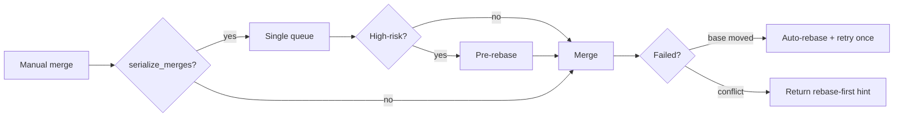

# Configuration

Kagan reads `config.toml` from your XDG config directory.

## TL;DR

```toml
[general]
default_worker_agent = "claude"
default_pair_terminal_backend = "tmux"
max_concurrent_agents = 3
auto_review = true
```

## File locations

| Path                         | Purpose              |
| ---------------------------- | -------------------- |
| XDG config dir `config.toml` | Settings             |
| XDG data dir `kagan.db`      | Task database        |
| XDG data dir `kagan.lock`    | Single-instance lock |
| Temp dir `kagan/worktrees/`  | Git worktrees        |

## General settings

```toml
[general]
auto_review = true
auto_approve = false
require_review_approval = false
serialize_merges = true
default_base_branch = "main"
default_worker_agent = "claude"
default_pair_terminal_backend = "tmux"
max_concurrent_agents = 3
mcp_server_name = "kagan"
# default_model_claude = "claude-3-5-sonnet"
# default_model_opencode = "opencode-default"
```

| Setting                         | Default    | Purpose                                                 |
| ------------------------------- | ---------- | ------------------------------------------------------- |
| `auto_review`                   | `true`     | Run AI review on task completion                        |
| `auto_approve`                  | `false`    | Skip planner permission prompts                         |
| `require_review_approval`       | `false`    | Require approved review before merge                    |
| `serialize_merges`              | `true`     | Queue merges sequentially; auto-retry once after rebase |
| `default_base_branch`           | `"main"`   | Base branch for worktrees and merges                    |
| `default_worker_agent`          | `"claude"` | Default agent for new tasks                             |
| `default_pair_terminal_backend` | `"tmux"`   | `tmux`, `vscode`, or `cursor`                           |
| `max_concurrent_agents`         | `3`        | Max parallel AUTO runs                                  |
| `mcp_server_name`               | `"kagan"`  | MCP server name exposed to clients                      |
| `default_model_claude`          | unset      | Optional default model                                  |
| `default_model_opencode`        | unset      | Optional default model                                  |

## Agent configuration

```toml
[agents.claude]
identity = "claude.com"
name = "Claude Code"
short_name = "claude"
protocol = "acp"
active = true

[agents.claude.run_command]
"*" = "npx claude-code-acp"

[agents.claude.interactive_command]
"*" = "claude"
```

| Field                 | Purpose                     |
| --------------------- | --------------------------- |
| `identity`            | Unique agent identifier     |
| `name`                | Display name                |
| `short_name`          | Compact UI label            |
| `protocol`            | Agent protocol (`acp`)      |
| `active`              | Enable/disable agent        |
| `run_command`         | AUTO execution command      |
| `interactive_command` | PAIR interactive command    |
| `model_env_var`       | Optional model env variable |

OS-specific commands use platform keys (`macos`, `linux`, `"*"` fallback):

```toml
[agents.myagent.run_command]
macos = "my-agent-mac"
linux = "my-agent-linux"
"*" = "my-agent"
```

## UI settings (`[ui]`)

| Setting                  | Default | Purpose                      |
| ------------------------ | ------- | ---------------------------- |
| `skip_pair_instructions` | `false` | Skip PAIR instructions modal |

## Refinement settings (`[refinement]`)

| Setting             | Default           | Purpose                   |
| ------------------- | ----------------- | ------------------------- |
| `enabled`           | `true`            | Enable prompt refinement  |
| `hotkey`            | `"f2"`            | Trigger refinement        |
| `skip_length_under` | `20`              | Skip very short prompts   |
| `skip_prefixes`     | `["/", "!", "?"]` | Skip command-like prompts |

## Environment variables

### Agent runtime

| Variable                | Description          |
| ----------------------- | -------------------- |
| `KAGAN_TASK_ID`         | Current task ID      |
| `KAGAN_TASK_TITLE`      | Current task title   |
| `KAGAN_WORKTREE_PATH`   | Task worktree path   |
| `KAGAN_PROJECT_ROOT`    | Repo root            |
| `KAGAN_MCP_SERVER_NAME` | Override server name |

### Core instrumentation

Temporary diagnostics for alpha builds.

| Variable                         | Default | Description                                      |
| -------------------------------- | ------- | ------------------------------------------------ |
| `KAGAN_CORE_INSTRUMENTATION`     | off     | In-memory counters/timings for selected hotspots |
| `KAGAN_CORE_INSTRUMENTATION_LOG` | off     | Structured instrumentation events to logs        |

Instrumented hotspots: process adapter, task list queries, git commands.

## Core process

```bash
kagan core status
kagan core stop
```

Core autostarts with `kagan`/`kagan tui`, is a shared singleton, and auto-stops after `general.core_idle_timeout_seconds` once all clients disconnect.

## Merge and scheduling behavior



**AUTO scheduling:** `max_concurrent_agents` is an upper bound. Non-overlapping tasks run in parallel; overlapping tasks enter a blocked state and auto-resume when blockers reach `DONE`.

## MCP server options

| Option                              | Purpose                                |
| ----------------------------------- | -------------------------------------- |
| `--readonly`                        | Read-only toolset                      |
| `--session-id`                      | Bind server to one session lane        |
| `--capability`                      | Restrict tool access by profile        |
| `--identity`                        | Select identity lane                   |
| `--endpoint`                        | Override core endpoint discovery       |
| `--enable-internal-instrumentation` | Enable internal diagnostics instrument |

## Minimal config

```toml
[general]
default_worker_agent = "claude"
default_pair_terminal_backend = "tmux"
max_concurrent_agents = 3
```
