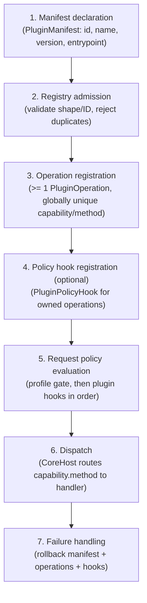

# Plugin SDK Lifecycle

Provider-neutral manifest, registration, policy, dispatch, and validation contracts for alpha plugins. GitHub provider plugin behavior (import, sync, export) is out of scope.

## Lifecycle



## Conformance checklist

- [ ] Manifest validates against `PluginManifest` (`extra="forbid"`; required fields present)
- [ ] Plugin ID matches `^[a-z][a-z0-9_.-]{2,63}$`
- [ ] Plugin registers at least one operation
- [ ] Operation capability/method names match SDK patterns, no collisions
- [ ] Optional policy hooks only for owned operations
- [ ] Handlers return JSON-serializable dict payloads
- [ ] No provider-specific behavior in scaffold validation plugins

## Validation

```bash
uv run pytest tests/core/unit/test_plugin_sdk.py -v
```

Built-in provider-neutral stub: `src/kagan/core/plugins/examples/noop.py`.
